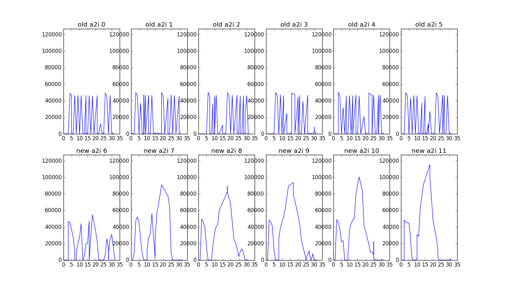
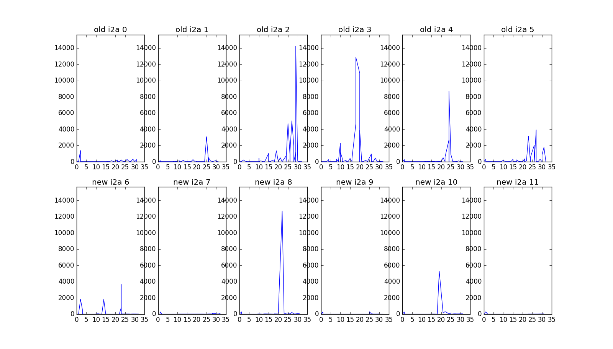
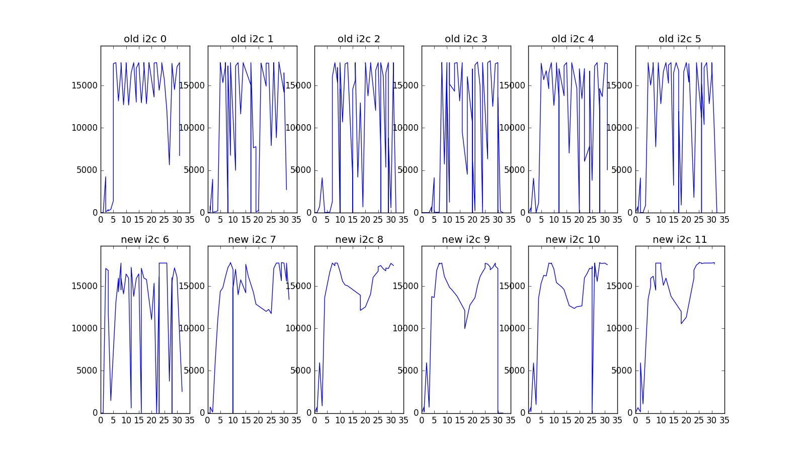
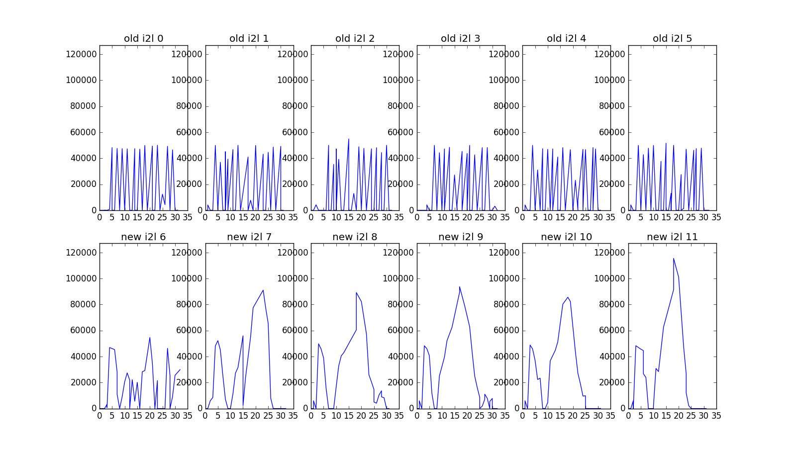
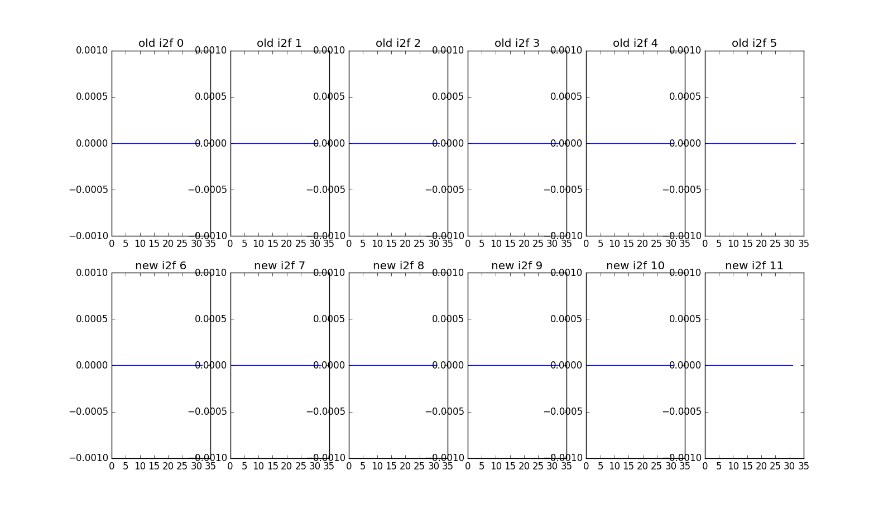
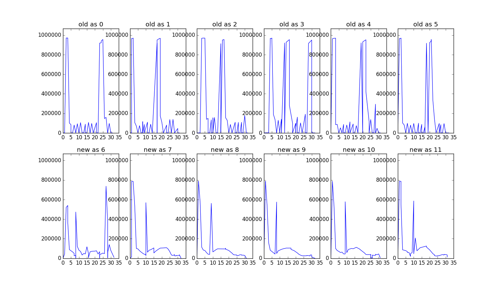
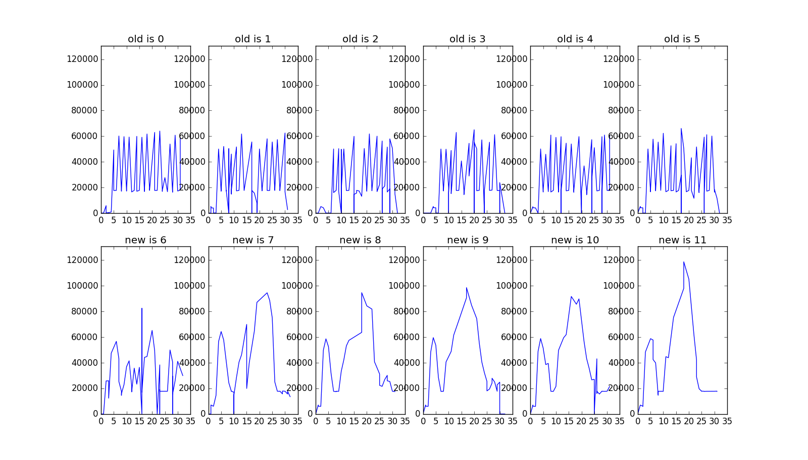
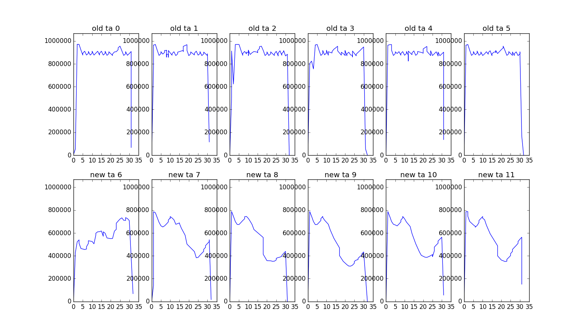
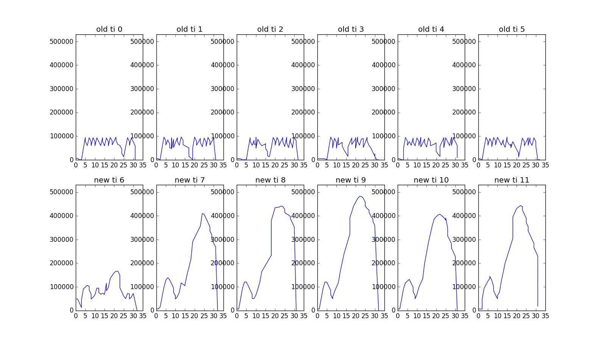

# Assignment 3 Writeup

We tested out modifications but running `stress -m 16 --vm-bytes 390M -t 30s` which uses 16 workers each calling `malloc`to allocate 390MB touching 1 byte every 4KB over the whole range of memory allcoated and then frees the memory. Within the 30s duration it runs through the sequence of malloc -> touch -> free as many times as possible (before timing out). Since this uses more than the availble 4GB of memory, the kernel is forced to scan respond to the stress.

The test was run 6 times with the original kernel as well as 6 times with the modified kernel. We tracked pages trasitioning from active to inactive (a2i), inactive to active (i2a), inactive to cache (i2c), inactive to laundry (i2l), inactive to free (i2f), the total number of active (as) and inactive (is) pages scanned as well as the total number of page in either queue (ta & ti).

## Active to Inactive

With the original FreeBSD paging algorithm you can see that there is a more consistent number of pages transitioning from active to inactive where as our implementation experiences a large spike around 17s. We surmise that this is a symptom of a less efficient/effective algorithm because is has a less consistent runtime. 

## Inactive to Active

In the FreeBSD pages get sent to inactive to early because they need to be sent back to active. Ours doesn't on average send that many pages back to active and it better at deciding when a page is inactive. Which can be explained by the large spike in active to inactive.

## Inactive to Cache

Our algorithm exhibit a smoother behaviour in the number of pages transitioning from inactive to cache. We think this is because we scan all pages more frequently resulting in more frequent caching. 

## Inactive to Laundry

Once again the old algorithm is much more consistent than ours with consistent run times. Since inactive pages are moved to the end of the freelist. This results in a build up of pages that need to be laundered thus the spike in the Inactive to Landry. XXX compare to original algorithm

## Inactive to Free

All pages are valid as there is no memory corruption occuring. There are no notable differences between the two algorithms here.

## Active Scanned

## Inactive Scanned

## Total Active in Queue

## Total Inactive in Queue

